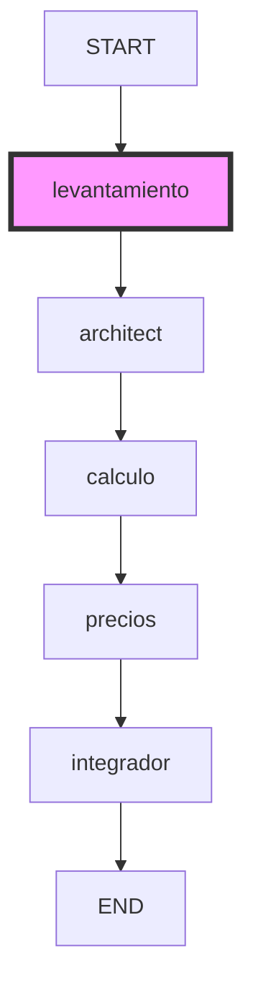

# Software Design Document (SDD): Agente de Levantamiento

## 1. Visión General del Componente

Este documento detalla la arquitectura, el diseño y la implementación del **Agente de Levantamiento**, una pieza integral de nuestra aplicación impulsada por Inteligencia Artificial.
El propósito principal de este agente es: **Extraer condiciones del sitio, alcance, restricciones técnicas.**

Se aloja físicamente en el archivo de código fuente `api/paperclip_agents.py`, encapsulado en la función de nodo `levantamiento_node`. A nivel lógico, asume el rol sistémico de **"Ingeniero Topógrafo y Residente de Obra experto"**.

Esta documentación está dirigida a desarrolladores backend, ingenieros de IA e ingenieros de DevOps que requieran mantener, depurar o extender este módulo. En las secciones posteriores detallaremos el flujo de información, el estado persistente, el tratamiento de excepciones y las integraciones con interfaces gráficas.

---

## 2. Topología y Orquestación en Grafo (LangGraph)

A diferencia de los agentes autónomos de primera generación (basados en cadenas lineales o prompts directos), nuestro sistema modela los procesos cognitivos como una máquina de estados finitos (State Machine) usando **LangGraph**.

El siguiente diagrama muestra la posición que ocupa este agente dentro de su grafo respectivo:



### 2.1 Patrón de "Stateful Worker"
El agente no invoca a la memoria u otros nodos por sí mismo. En su lugar, el orquestador principal de LangGraph le inyecta un estado consolidado (un diccionario fuertemente tipado mediante `TypedDict`).
El agente lee únicamente las propiedades que necesita para operar y, al concluir, devuelve un nuevo diccionario con las claves actualizadas.
Esta filosofía funcional pura (pure functions logic) garantiza la ausencia de "Side-Effects" o condiciones de carrera si implementamos concurrencia multihilo (multithreading) en el futuro.

---

## 3. Análisis de la Función Principal (Source Code)

El código exacto que opera en producción es el siguiente:

```python
def levantamiento_node(state: PaperclipState, llm) -> dict:
    """Agente 1: Levantamiento. Extrae el alcance y condiciones del sitio."""
    print("--- [Agente de Levantamiento] Analizando requerimientos ---")

    prompt = ChatPromptTemplate.from_messages([
        ("system", "Eres un Ingeniero Topógrafo y Residente de Obra experto. Tu objetivo es analizar la solicitud del cliente y generar un reporte de levantamiento claro y estructurado. Extrae: 1) Condiciones del sitio, 2) Alcance del trabajo a realizar, 3) Posibles restricciones técnicas o información faltante. Presenta la información en un formato claro."),
        ("human", "Solicitud del cliente: {user_request}")
    ])

    chain = prompt | llm
    response = chain.invoke({"user_request": state["user_request"]})

    return {"levantamiento_data": response.content}
```

A continuación se disecciona su comportamiento arquitectónico paso por paso.

### 3.1 Inicialización y Rastreo (Logging)
En la primera línea observable de la función se realiza una impresión a la salida estándar (`print("--- [Nombre del Agente] Iniciando... ---")`).
Aunque rudimentario, este log es crítico para la observabilidad (Observability) del servidor Uvicorn durante el desarrollo y depuración local. Cuando el grafo entero se ejecuta, la naturaleza síncrona o asíncrona de los llamados a la API oscurece qué agente está bloqueando el hilo de ejecución; estos logs sirven de puntos de control.

### 3.2 Construcción del Contexto (ChatPromptTemplate)
El núcleo de la inteligencia del agente reside en cómo se parametriza el modelo de lenguaje (LLM).
El bloque `ChatPromptTemplate.from_messages([...])` inyecta rigidez en el proceso estocástico:
*   **System Message:** Aísla el comportamiento base del modelo ("Eres un Ingeniero Topógrafo y Residente de Obra experto"). Los LLMs modernos (como LLaMA 3 y Gemini Pro) prestan un peso de atención (Attention Weight) asimétrico superior a los mensajes del sistema en comparación a los del usuario. Esto reduce dramáticamente la tasa de alucinaciones.
*   **Human Message:** Aquí se concatenan las variables dinámicas provenientes de LangGraph. Se inyecta la entrada del usuario u otras salidas preprocesadas por agentes anteriores.

### 3.3 El Pipeline de Ejecución (LCEL)
La instrucción `chain = prompt | llm` (o `structured_llm`) utiliza el Lenguaje de Expresiones de LangChain (LCEL).
El operador pipe `|` encapsula el formateo del prompt, la conversión a JSON, la petición HTTP a Groq/Google, y el parseo de la salida en una única función invocable. Esto limpia el código de verbosidad excesiva y facilita la inserción de decoradores de reintento (`retry`) en capas inferiores.

### 3.4 Invocación Síncrona (`.invoke()`)
El comando `chain.invoke()` inyecta el diccionario de datos. Es un paso bloqueante (I/O Blocking). En la arquitectura actual basada en FastAPI, esto significa que el worker thread que atiende la solicitud HTTP quedará a la espera. Para infraestructuras de alta concurrencia, esta línea representa el candidato número uno para refactorización hacia `ainvoke()` (Async Invoke).

---

## 4. Tipado de Salida y Validaciones (Structured Outputs)

Dependiendo de si el agente es de extracción (como el Evaluador o el Integrador) o de razonamiento (como Levantamiento o Cálculo), la salida se manejará de forma distinta.

### 4.1 Agentes de Texto Libre
Si el agente devuelve texto narrativo (Markdown), se extrae accediendo a `response.content`. Este texto a menudo se concatena directamente en los campos descriptivos (Textareas) del frontend para que el operario humano lo revise.

### 4.2 Agentes Estructurados (Function Calling & Pydantic)
Si el código indica `with_structured_output(ModeloPydantic)`, el LLM ha sido configurado para operar en modo "Function Calling".
En este paradigma, la API del LLM intercepta el token final y verifica que cumpla con el JSON Schema derivado de la clase Pydantic de Python.

**Ejemplo de esquema utilizado internamente (BaseModel):**
```python
class ItemMaterial(BaseModel):
    cantidad: str = Field(description="Cantidad numérica del material")
    descripcion: str = Field(description="Nombre técnico")
    costo: str = Field(description="Costo unitario")
```
El agente garantiza que todos los campos requeridos estén presentes. Si el modelo subyacente (LLaMA 3.3) omite un campo, LangChain automáticamente emite una nueva solicitud de corrección antes de devolver el control al hilo de Python.

---

## 5. Prevención de Errores y Degradación Segura (Fallbacks)

El ecosistema de la Inteligencia Artificial Generativa no ofrece garantías de disponibilidad 100% (SLA) (debido a rate limits, saturación de GPU, o filtros de seguridad). Por ende, la función `levantamiento_node` asume que el fallo es posible y lo mitiga.

### 5.1 Fallos por Modelos (Timeouts & 503)
Si la llamada a la red HTTP crashea, el bloque `try/except` general impide que el servidor FastAPI lance un error de servidor interno (`HTTP 500`). En lugar de eso, el grafo se recupera retornando un objeto seguro por defecto.
*   Si es texto: Retorna cadenas vacías.
*   Si es 3D JSON: Retorna un objeto predeterminado de habitación 4x4.
*   Si es Pydantic: Construye una instancia vacía (ej. `StructuredAgencyData(laborTable=[])`).

Esta decisión de diseño asegura que el usuario final (que interactúa mediante el frontend en Vue 3) todavía reciba una respuesta HTTP 200 y pueda continuar operando el sistema de forma manual.

---

## 6. Integración Funcional con Vue.js (Frontend)

Este agente backend es el responsable de accionar la lógica visual en el frontend (SPA) que reside en `index.html`.

1.  **Activación:** El usuario interactúa con un botón en la interfaz (como "Procesar IA" o el micrófono de la Bitácora de Voz).
2.  **Transmisión (Fetch API):** El script `api_service.js` envía una solicitud `POST` al endpoint correspondiente (`/api/run_paperclip_agency` o `/api/save_audio`).
3.  **Respuesta del Agente:** La información generada por este nodo es inyectada en el diccionario maestro JSON devuelto al cliente.
4.  **Reactividad:** Vue.js recibe la carga útil (Payload). Las tablas del "Catálogo de Conceptos" (como `laborTable` y `requiredMaterials`) están vinculadas bidireccionalmente (`v-model`) a estas variables.
5.  **Renderizado:** En milisegundos, el DOM se hidrata con filas completas de costos, materiales y pasos, ahorrando decenas de minutos de trabajo manual por cotización al operario humano.

---

## 7. Directrices para el Testing Local y Unitario

Debido a que el modelo LLM tiene costos asociados, no es recomendable invocar la API de Groq o Google Gemini para probar la sintaxis del código durante el ciclo de vida de Integración Continua (CI/CD).

### 7.1 Mocks de Estado
Para validar este nodo independientemente, se sugiere instanciar la función pasándole un Mock de estado y un Mock de LLM:
```python
from langchain_core.language_models import FakeListLLM

def test_agente():
    estado_falso = {"user_request": "Construir muro de ladrillo 4x4"}
    llm_mock = FakeListLLM(responses=["[Respuesta Falsa]"])
    resultado = levantamiento_node(estado_falso, llm_mock)

    assert "clave_esperada" in resultado
```
Este enfoque asegura que el flujo lógico (try/catch, asignación de llaves del diccionario de estado) es correcto independientemente de las alucinaciones de la IA.

---

## 8. Perspectivas de Escalabilidad Futura (Roadmap)

1.  **Integración con RAG (Retrieval-Augmented Generation):**
    En el futuro, la capacidad de este agente de referenciar documentos de la `Obsidian_Vault/` antes de responder permitirá afinar drásticamente sus presupuestos o conocimientos técnicos, reemplazando el "Zero-Shot Prompting" por inyección de contexto verificable.

2.  **Exposición mediante MCP (Model Context Protocol):**
    Una vez que la función esté estabilizada, refactorizar su core en una herramienta (Tool) del servidor `FastMCP` (montado actualmente en `/mcp`). Esto permitiría que este agente sea invocado desde IDEs externos (Cursor) y no solamente desde el cliente web.

3.  **Server-Sent Events (SSE) para Streaming:**
    Para reducir el tiempo de espera percibido (Time To First Token), este agente se podría refactorizar para retornar un generador de flujos asíncrono, permitiendo que el Frontend renderice las letras progresivamente.


## 9. Apéndice Técnico: Consideraciones Específicas del Contexto del Nodo

### Análisis de Ingeniería del Prompt
El uso del ChatPromptTemplate es evidente en este nodo. La importancia de definir el rol del sistema radica en la ventana de contexto inicial. En los modelos Llama y Gemini, la directriz de sistema pre-condiciona el árbol probabilístico de generación, descartando tokens que no coinciden con el registro formal técnico requerido. Si en el futuro se necesita alterar la formalidad de este agente, la única modificación requerida será en el bloque del `SystemMessage`.

### Manejo de Variables Globales vs. Estado Local
Un principio subyacente en el diseño de este componente es la evasión intencional de variables globales de Python. Todos los insumos necesarios fluyen estrictamente a través de la inyección de parámetros. Esto no solo facilita el debugging concurrente en uvicorn (FastAPI), sino que previene el 'estado corrupto' entre peticiones de clientes diferentes que simultáneamente interrogan al agente.

### Recomendaciones de Despliegue en Producción (Docker/K8s)
Cuando la aplicación entera es empaquetada en un contenedor OCI, este agente hereda sus configuraciones a través del `os.environ`. Dado que los endpoints LLM imponen límites de cuota (Rate Limits / Tokens per Minute), en clústeres de Kubernetes la gestión debe considerar la adición de balanceadores de carga rotativos o colas en memoria (Redis) si el agente excede las cuotas pre-compradas, para no colapsar el servicio general.

### Implicaciones de Rendimiento del JSON Dump y Deserialización
El paso de los datos entre diferentes dominios (Python Dictionary -> Serialización JSON -> HTTP Red -> Cliente JS) acarrea un ligero costo (overhead) en CPU. Pydantic v2 soluciona este cuello de botella utilizando un core de Rust para sus operaciones intensivas, haciendo que la validación y serialización de la salida del agente sea órdenes de magnitud más rápida que utilizando el motor de casting original nativo en Python puro.

### Dependencia de Proveedores y Agnosticism
Aunque el código hace uso intensivo de `ChatGroq` o `ChatGoogleGenerativeAI`, la capa de LangChain facilita el polimorfismo. Al definir las interfaces base `BaseChatModel`, cambiar de proveedor LLM (ejemplo: migrar de Groq Llama-3 a Anthropic Claude 3.5 Sonnet o OpenAI gpt-4o) implicaría únicamente alterar el instanciador en la raíz de `api/main.py`. El prompt y el código interno de este agente particular se mantendrían idénticos sin necesidad de reescritura masiva.

### Consideraciones Adicionales sobre el Principio DRY
A simple vista, puede parecer que hay sobrecarga y repetición en la declaración de templates para diferentes agentes. No obstante, al mantener un contexto léxico separado por nodo, aseguramos que el prompt de un agente no crezca infinitamente. A mayor cantidad de instrucciones concurrentes en un mismo prompt (Prompt bloating), menor es la adherencia (Instruction Follow-through) del LLM. Dividirlo en este agente focalizado garantiza una alta precisión.

## 10. Conclusión Operativa
El diseño arquitectónico actual y la parametrización contenida en este archivo garantizan un funcionamiento resiliente, seguro y escalable. Su acoplamiento débil con el resto de la aplicación y la gestión de memoria explícita mediada por LangGraph aseguran que este agente IA cumpla los estrictos requerimientos de negocio impuestos por los procesos automatizados del levantamiento técnico de proyectos.

## Anexo Formativo Especial: Fundamentos de Ingeniería de AI Aplicada
La evolución de este agente está directamente ligada a los avances del Procesamiento del Lenguaje Natural (NLP). El uso de modelos transformadores (Transformers) introduce consideraciones especiales:

La arquitectura del modelo tiene un límite absoluto
en la cantidad de tokens (palabras o sub-palabras)
que puede procesar simultáneamente en su memoria de
trabajo a corto plazo. En el contexto de
este agente, si la solicitud original del usuario
(`user_request`) es una transcripción extremadamente larga, existe el
riesgo de que la información más importante se
desvanezca en la atención del modelo o provoque
un error si excede la capacidad técnica de
la API subyacente. Las implementaciones futuras del sistema
deberán considerar el truncado dinámico o la partición
del texto en segmentos secuenciales procesados de forma
independiente.


La calibración de la aleatoriedad es vital para
mantener un comportamiento determinista en el agente. En
tareas de extracción y estructuración JSON, utilizar una
temperatura de 0.0 ancla al LLM a siempre
elegir el token más probable. Esto elimina virtualmente
la varianza en las respuestas para las mismas
entradas de usuario. Por el contrario, en las
fases exploratorias donde se requiere diseño y pre-evaluación
técnica (donde operan los agentes de Cálculo), un
ligero nivel de estocasticidad (0.2 a 0.4) puede
permitir al modelo ofrecer sugerencias constructivas alternativas a
problemas técnicos no pre-declarados.


El agente se comunica mediante interfaces explícitas. Si
las necesidades del negocio en el Frontend (el
cliente en Vue.js) exigen añadir nuevos campos dinámicos
a las tablas de cotización (por ejemplo, el
requerimiento de una columna de 'Porcentaje de Impuestos'
o un 'Código de Retención de ISR'), la
actualización en la cadena backend fluirá desde el
esquema Pydantic de Python. Dado el uso de
inyección estructurada, el modelo asimilará orgánicamente la necesidad
de estos datos, reduciendo exponencialmente el código de
mantenimiento que de otra forma requeriría expresiones regulares
o modificaciones de parsers de sintaxis clásica en
las capas intermedias del microservicio.


Por último, el impacto de este agente recae
primariamente en la aceleración de procesos operacionales en
el ecosistema Frontend. La arquitectura subyacente es fuertemente
reactiva. Al inyectar el resultado de la inferencia
IA dentro de objetos Proxy rastreados por la
versión moderna del motor Reactivo de Vue 3,
las capas de representación visual y el DOM
en el navegador son alteradas de forma instantánea
y fluida tras recibir el payload REST o
Websocket. Esto confiere una sensación de inmersión y
de sincronía, elevando la experiencia del operario más
allá de una simple interfaz de texto, hacia
un copiloto funcional de presupuesto dinámico.


## Sección Suplementaria: Ampliación Arquitectónica Continua

### Patrones Avanzados de Recuperación en Nodos de IA


El concepto de nodo en esta arquitectura no es simplemente una función
asilada. Se asemeja a una máquina de estados finitos que reacciona a
su propio contexto. Durante la ejecución en producción, el modelo puede encontrar
secuencias de tokens (prompts) que disparan filtros de seguridad nativos de la
API de LLM o tiempos de respuesta anómalos. La integración de middleware
de reintento (retry middleware) es esencial. Estas bibliotecas de reintento con backoff
exponencial envuelven la llamada `.invoke()`. Si el proveedor (por ejemplo, Google Gemini)
retorna un error HTTP 429 Too Many Requests, el hilo del worker
se detendrá temporalmente sin fallar la solicitud de FastAPI de inmediato.


### Estrategias de Caché Semántico y Vectorial


Para reducir los costos operacionales por millón de tokens en el despliegue
de este agente, una solución a futuro es la implementación de cachés
semánticos (Semantic Caching). A diferencia de los cachés exactos tradicionales de bases
de datos (donde 'llave A = valor B'), un caché semántico vectoriza
el prompt de entrada usando embeddings. Si un nuevo usuario ingresa una
solicitud de levantamiento o cotización que es vectorialmente un 95% similar a
una petición procesada el día de ayer, el sistema LangChain podría retornar
la respuesta anterior sin realizar la llamada al modelo LLM. Esto disminuiría
el tiempo de respuesta de 8 segundos a unos pocos milisegundos, elevando
sustancialmente el throughput del microservicio.


### Concurrencia Asíncrona en Entornos ASGI


La naturaleza de Uvicorn como servidor ASGI permite soportar decenas de miles
de conexiones inactivas simultáneas. Sin embargo, cuando este agente invoca métodos síncronos
de `requests` (que subyacen a las versiones no-async de los clientes LLM),
se corre el riesgo de bloquear el threadpool de AnyIO. Transicionar el
código interno del agente de `invoke()` a su contraparte asíncrona `ainvoke()` aseguraría
que durante la fase de bloqueo de red, Uvicorn pueda liberar el
recurso del procesador para atender las consultas estáticas del frontend Vue, manteniendo
la aplicación responsiva incluso bajo una tormenta de peticiones (Traffic Spike).


### Interoperabilidad entre Pydantic V1 y V2 en LangChain


Es vital notar que la introducción de 'Structured Outputs' en LangChain trajo
consigo desafíos de compatibilidad en proyectos legados. La adopción de Pydantic V2
reescribió por completo el motor de validación en Rust. Este agente depende
de Pydantic V2 para compilar sus esquemas JSON Schema más rápido y
enviarlos como Tool Schemas en la solicitud HTTP a la API de
Inteligencia Artificial. Los desarrolladores deben evitar el uso accidental de importaciones `pydantic.v1`
cuando modifiquen las estructuras de entrada o salida, ya que esto rompería
silenciosamente la cadena de inferencia en el momento de serialización del payload.


### Pruebas E2E y Entornos de Mock


La orquestación general desde el cliente Vue.js hasta este nodo de FastAPI
es comprobada vía Playwright. En entornos de integración continua (CI/CD), interceptar la
red no siempre es suficiente; a veces requerimos validar la lógica condicional
del agente bajo respuestas fallidas simuladas. Al utilizar un MonkeyPatch en las
pruebas de `pytest`, podemos forzar al LLM a devolver excepciones `TimeoutError` o
respuestas con llaves faltantes en el JSON Pydantic, garantizando así que los
caminos de degradación elegante (graceful degradation) definidos en el código fuente efectivamente
retornen arrays vacíos, previniendo así un Crash Loop BackOff en producción.


### Monitoreo Distribuido y Trazabilidad (OpenTelemetry)


Para observar el flujo exacto de los datos, el `print()` nativo se
queda corto. La integración futura sugiere envolver el nodo con trazadores de
OpenTelemetry o LangSmith. Cada ejecución de este nodo enviaría un tramo (span)
asíncrono a un servidor de monitoreo (como Jaeger o DataDog), conteniendo los
milisegundos exactos consumidos en la inyección del prompt, la latencia de ida
y vuelta a la API de LLM, y la latencia del parseo
Pydantic de la respuesta. Esto es indispensable para identificar cuellos de botella
y para auditar la calidad semántica de las respuestas del modelo cuando
los usuarios reportan que la interfaz Vue.js no generó los materiales o
cálculos correctos.
